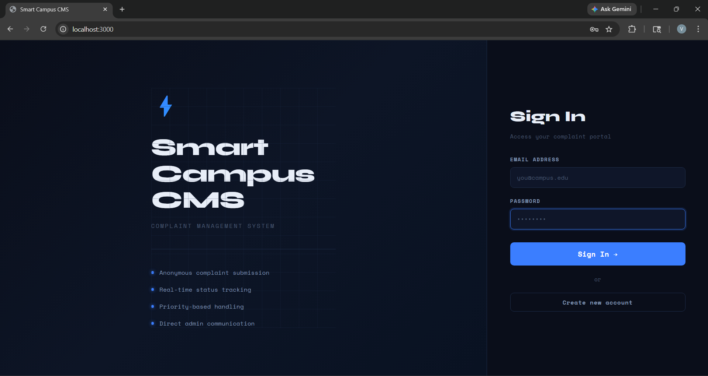
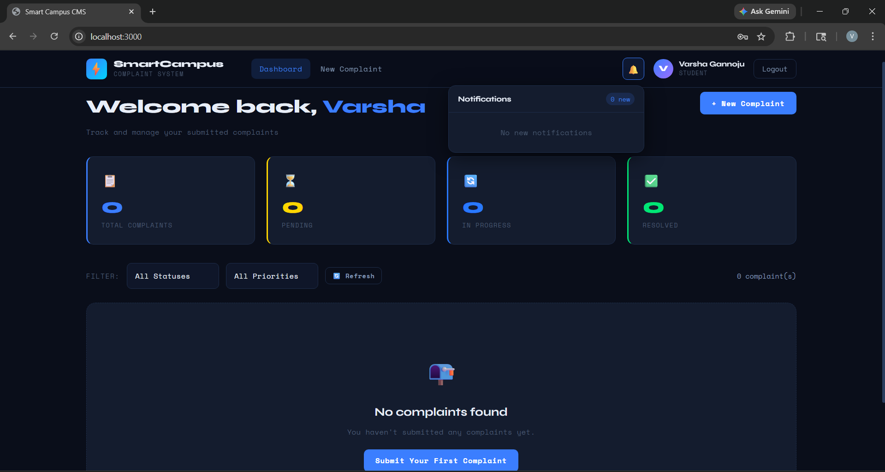
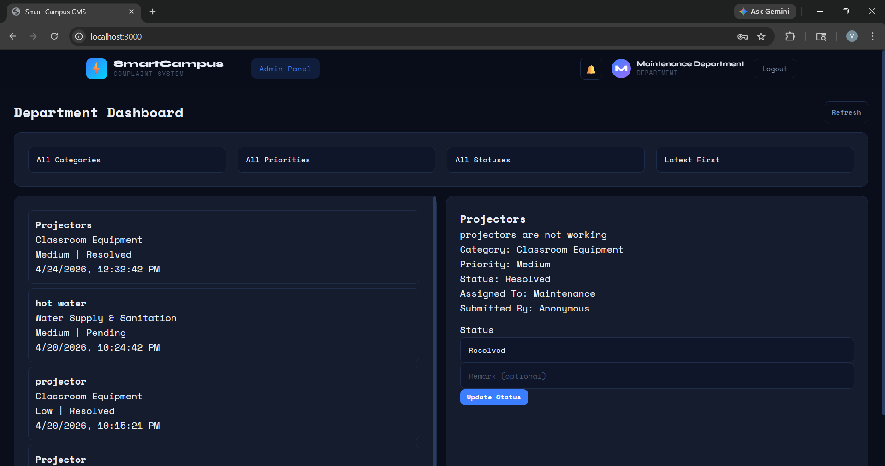
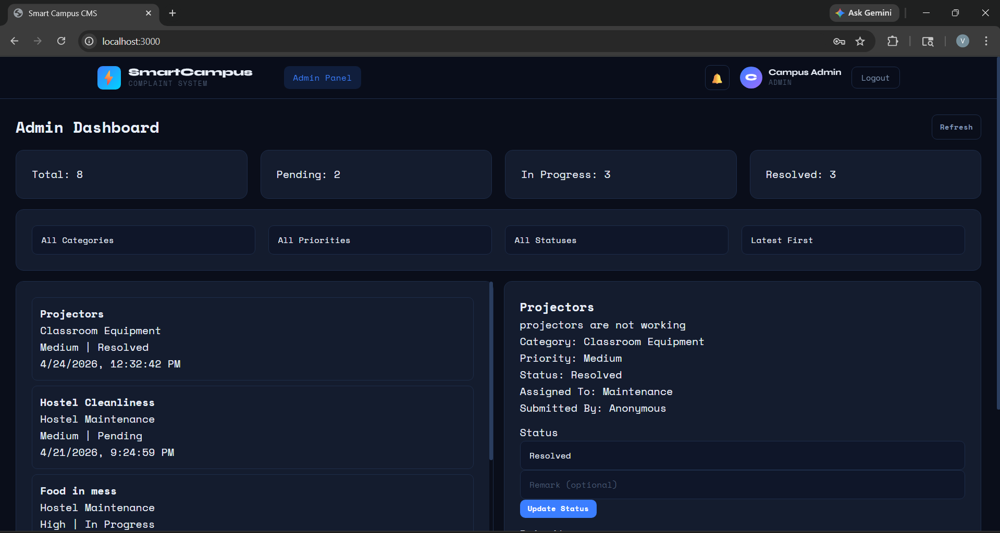
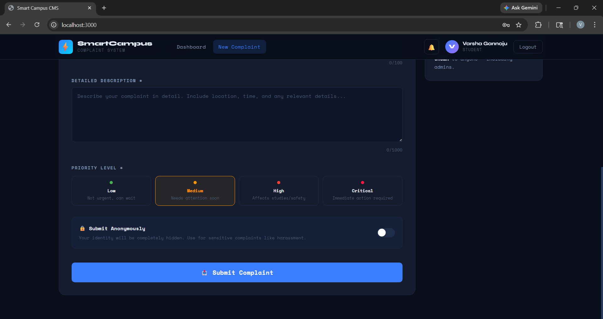

# 🏫 Smart Campus Complaint Management System

A full-stack **MERN (MongoDB, Express.js, React.js, Node.js)** web application that streamlines campus complaint management by enabling students to submit complaints, departments to resolve them, and administrators to oversee the entire complaint lifecycle through secure role-based dashboards.


---

# 📖 Overview

Managing campus complaints manually through paper forms, emails, or informal communication often results in delayed resolutions, poor transparency, and inefficient coordination between students and campus authorities.

The **Smart Campus Complaint Management System** provides a centralized web platform that allows students to submit and monitor complaints while enabling departments and administrators to efficiently manage, track, and resolve issues in real time.

The system improves transparency, accountability, and communication across the campus.

---

# ❗ Problem Statement

Many educational institutions still rely on traditional methods for handling student complaints.

This leads to several problems:

- Students cannot easily track complaint progress.
- Complaint resolution is often delayed.
- Departments receive complaints through multiple disconnected channels.
- Administrators lack a centralized monitoring system.
- Students may hesitate to report sensitive issues because anonymous reporting is unavailable.

These challenges reduce operational efficiency and negatively impact the student experience.

---

# 💡 Solution

The Smart Campus Complaint Management System addresses these challenges by providing a centralized MERN-based platform where:

- Students can submit complaints online from anywhere.
- Anonymous complaint submission protects student privacy.
- Departments receive and manage complaints assigned to them.
- Administrators monitor and oversee the complete complaint lifecycle.
- Socket.IO provides real-time status updates.
- JWT authentication ensures secure access with role-based authorization.

---

# ✨ Features

- 🔐 Secure JWT Authentication
- 👨‍🎓 Student Registration & Login
- 👥 Role-Based Access Control
- 📝 Online Complaint Submission
- 🕵️ Anonymous Complaint Reporting
- 🔄 Real-Time Complaint Status Updates
- 📂 Complaint History Tracking
- 🏢 Department-wise Complaint Management
- 👨‍💼 Administrator Dashboard
- 📱 Responsive User Interface
- ⚡ Real-Time Communication using Socket.IO

---

# 🛠️ Tech Stack

## Frontend

- React.js
- JavaScript
- HTML5
- CSS3
- Axios

## Backend

- Node.js
- Express.js
- Socket.IO

## Database

- MongoDB
- Mongoose

## Authentication

- JWT (JSON Web Token)
- bcryptjs

## Additional Tools

- Multer
- dotenv
- CORS

---

# 📂 Project Structure

```
smart-campus-complaint-management-system/

├── backend/
│   ├── config/
│   ├── controllers/
│   ├── middleware/
│   ├── models/
│   ├── routes/
│   ├── utils/
│   ├── uploads/
│   ├── server.js
│   ├── seed.js
│   ├── package.json
│   └── .env.example
│
├── frontend/
│   ├── public/
│   ├── src/
│   │   ├── components/
│   │   ├── context/
│   │   ├── pages/
│   │   ├── styles/
│   │   ├── App.js
│   │   └── index.js
│   ├── package.json
│   └── .env.example
│
├── screenshots/
│   ├── login.png
│   ├── student-dashboard.png
│   ├── department-dashboard.png
│   ├── admin-dashboard.png
│   └── complaint-form.png
│
├── render.yaml
├── README.md
└── .gitignore
```

---

# 👥 User Roles

## 🎓 Student

- Register/Login
- Submit complaints
- Submit anonymous complaints
- Track complaint status
- View complaint history

---

## 🏢 Department

- View assigned complaints
- Update complaint status
- Resolve complaints

---

## 👨‍💼 Administrator

- Monitor all complaints
- Manage complaint workflow
- Oversee complaint resolution
- Manage users and departments

---

# 📸 Screenshots

## 🔐 Login Page



---

## 👨‍🎓 Student Dashboard



---

## 🏢 Department Dashboard



---

## 👨‍💼 Admin Dashboard



---

## 📝 Complaint Submission



---

# ⚙️ Installation

## Clone the Repository

```bash
git clone https://github.com/VarshaGannoju/smart-campus-complaint-management-system.git
```

```bash
cd smart-campus-complaint-management-system
```

---

## Backend Setup

```bash
cd backend
npm install
npm run dev
```

---

## Frontend Setup

```bash
cd frontend
npm install
npm start
```

---

## Environment Variables

Create a `.env` file inside the **backend** directory.

```env
PORT=5000
MONGO_URI=YOUR_MONGODB_CONNECTION_STRING
JWT_SECRET=YOUR_SECRET_KEY
CLIENT_URL=http://localhost:3000
```

---

## Run the Application

Backend

```
http://localhost:5000
```

Frontend

```
http://localhost:3000
```

---

# 🔐 Authentication Flow

1. User registers or logs in.
2. Passwords are securely hashed using bcryptjs.
3. JWT tokens are generated upon successful authentication.
4. Protected routes validate the JWT token.
5. Role-based authorization controls access to different dashboards.

---

# 🚀 Future Enhancements

- 📧 Email Notifications
- 📱 Mobile Application
- 📊 Complaint Analytics Dashboard
- 🔔 Push Notifications
- 🌍 Multi-Campus Support
- 📎 Multiple File Attachments
- 📈 Complaint Priority Prediction

---

# 📚 Learning Outcomes

This project helped me strengthen my understanding of:

- Full-Stack MERN Development
- REST API Design
- Express.js Backend Development
- MongoDB Database Design
- JWT Authentication
- Role-Based Access Control (RBAC)
- Real-Time Communication using Socket.IO
- React Component-Based Architecture
- Client-Server Communication
- Secure Authentication & Authorization

---

# 🤝 Contributing

Contributions are welcome.

1. Fork the repository.

2. Create a new branch.

```bash
git checkout -b feature-name
```

3. Commit your changes.

```bash
git commit -m "Add new feature"
```

4. Push your branch.

```bash
git push origin feature-name
```

5. Open a Pull Request.

---

# 👩‍💻 Author

**Varsha Gannoju**

- GitHub: https://github.com/VarshaGannoju
- LinkedIn: https://www.linkedin.com/in/varsha-gannoju-481780362/

---

## ⭐ Support

If you found this project useful, consider giving it a ⭐ on GitHub.

Made with using the MERN Stack.
